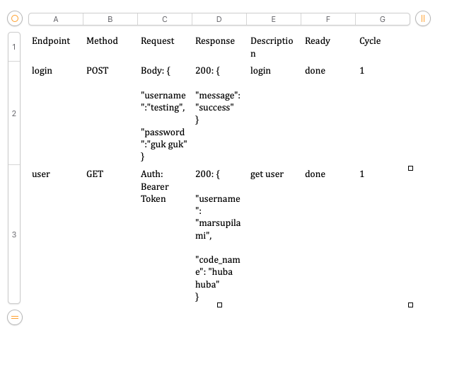

# postmant-to-docx

<p align="center">
<a href="https://andiahmads.github.io/olive.cpostmant-to-docx/"></a>
</p>

## Getting Started

Run:

```console
python3 -m venv venv
source venv/bin/activate
pip install python-docx
```

## Generate docx

run:

```console
python3 format_v2.1.0.py       
```

```
